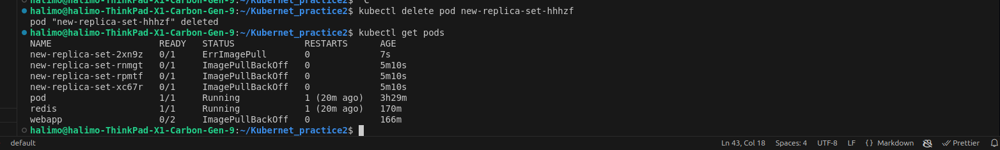

## Lab 2
1-Create a ReplicaSet using the below yaml

apiVersion: apps/v1
kind: ReplicaSet
metadata:
  name: new-replica-set
  namespace: default
spec:
  replicas: 4
  selector:
    matchLabels:
      name: busybox-pod
  template:
    metadata:
      labels:
        name: busybox-pod
    spec:
      containers:
      - command:
        - sh
        - -c
        - echo Hello Kubernetes! && sleep 3600
        image: busybox777
        imagePullPolicy: Always
        name: busybox-container

--------------------
2-How many PODs are DESIRED in the new-replica-set?
4
----------------------
3-What is the image used to create the pods in the new-replica-set?
busybox777
---------------------
4-How many PODs are READY in the new-replica-set?
0

---------------------
5-Why do you think the PODs are not ready?

------------------------
6-Delete any one of the 4 PODs. 
How many pods now
4 still 

---------------------
7-Why are there still 4 PODs, even after you deleted one?
because replicaset ensures the existence of the desired amount of pods at all times "4"
-----------------
8-Create a ReplicaSet using the below yaml

There is an issue with the file, so try to fix it.

apiVersion: v1
kind: ReplicaSet
metadata:
  name: replicaset-1
spec:
  replicas: 2
  selector:
    matchLabels:
      tier: frontend
  template:
    metadata:
      labels:
        tier: frontend
    spec:
      containers:
      - name: nginx
        image: nginx

To delete replicasets 

## Lab 3 
1-Create a deployment called my-first-deployment of image nginx:alpine in the default namespace.
Check to make sure the deployment is healthy.

----------------
2-Scale my-first-deployment up to run 3 replicas.
Check to make sure all 3 replicas are ready.

----------------
3-Scale my-first-deployment down to run 2 replicas.

---------------
4-Change the image my-first-deployment runs from nginx:alpine to httpd:alpine .

--------------------------
5-Delete the deployment my-first-deployment

----------------------------
6-Create deployment from the below yaml

apiVersion: apps/v1
kind: Deployment
metadata:
  name: frontend-deployment
  namespace: default
spec:
  replicas: 4
  selector:
    matchLabels:
      name: busybox-pod
  strategy:
    rollingUpdate:
      maxSurge: 25%
      maxUnavailable: 25%
    type: RollingUpdate
  template:
    metadata:
      labels:
        name: busybox-pod
    spec:
      containers:
      - command:
        - sh
        - -c
        - echo Hello Kubernetes! && sleep 3600
        image: busybox888
        imagePullPolicy: Always
        name: busybox-container

-------------
7-How many ReplicaSets exist on the system now?

------------------------------
8-How many PODs exist on the system now?

-----------------
9-Out of all the existing PODs, how many are ready?
0
-------------------
10-What is the image used to create the pods in the new deployment?
busybox888
---------------------
11-Why do you think the deployment is not ready?

---------------------

## Lab 4

- What is a namespace in Kubernetes, and why is it used?

used to divide clusters logically

---------------------
- How do you create a new namespace in Kubernetes using the kubectl command?
kubectl create namespace <namespace-name>
---------------------
- How can you list all namespaces in a Kubernetes cluster?
kubectl get namespaces
---------------------
- What is the default namespace in Kubernetes? What happens if you do not specify a namespace when deploying a resource?
default , the resource is assigned to default automatically
---------------------
- How do you delete a namespace in Kubernetes? What happens to the resources within it?
kubectl delete namespace <namespace-name>
---------------------
- How can you switch between namespaces while using the kubectl command?
kubectl config set-context --current --namespace=<namespace-name>
---------------------
- How do you create a Kubernetes deployment in a specific namespace?
define in the yaml file in the metadata under namespace 
metadata:
  name: deployment-name
  namespace: namespace-name
---------------------
- Can two different namespaces have resources with the same name? Explain your answer.
Namespaces provide a scope for names. Names of resources need to be unique within a namespace, but not across namespaces.
" From kubernets documentation "
---------------------
- How can you check the resource quotas and limits for a specific namespace?
kubectl describe quota --namespace=myspace
or 
kubectl get limitranges -n <namespace-name>
kubectl get resourcequotas -n <namespace-name>
---------------------
- How do you configure a kubectl context to always use a specific namespace by default?
kubectl config set-context --current --namespace=<namespace-name>
---------------------
- Create a YAML file to define a new namespace called dev-environment. Deploy it using kubectl.

---------------------
- Write a command to deploy a pod named test-pod running the nginx image into a namespace called testing.

---------------------
- List all the pods running in a namespace called production.

